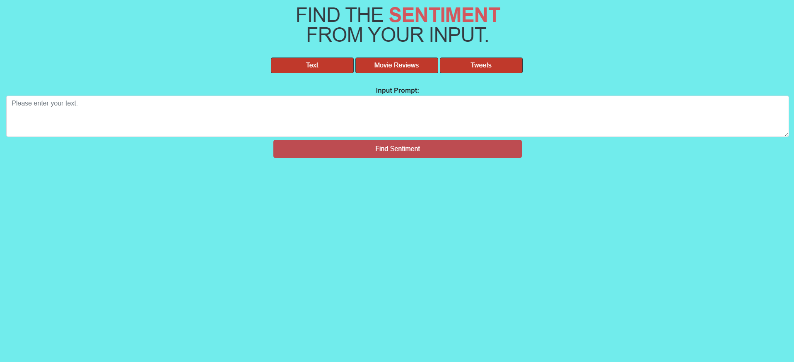
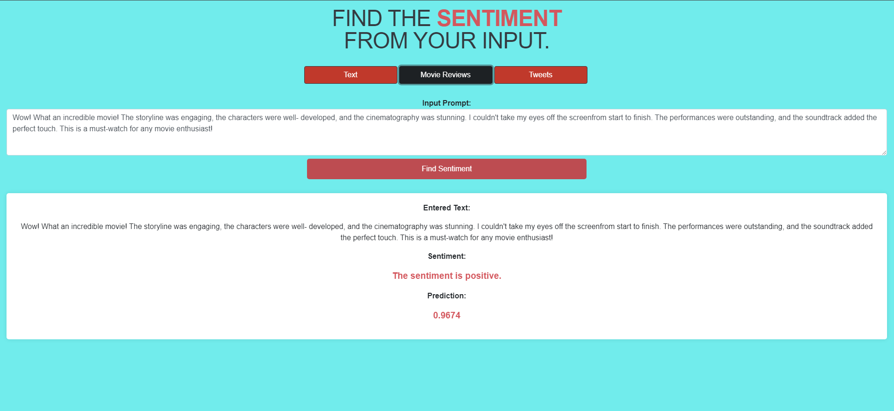

# Sentiment Analysis Flask API

## Overview
This Flask API performs sentiment analysis on various types of text input, including movie reviews, tweets, and generic text. It employs two LSTM models for movie reviews and tweets, along with a machine learning model for generic text analysis.

|-- flask_app
|   |-- templates
|   |   |-- index.html
|   |-- static
|   |   |-- styles
|   |   |   |-- style.css
|   |-- __init__.py
|   |-- main.py
|-- models
|   |-- sentiment_rnn_movie.model
|   |-- sentiment_rnn_tweet.model
|   |-- ml_sentiment_model.pkl
|-- run.py
|-- requirements.txt
|-- README.md

## Features


### File Descriptions

- **flask_app**: Contains the Flask application files.
  - `templates`: HTML templates for rendering web pages.
  - `static`: Static files like stylesheets.
  - `__init__.py`: Initialization file for the Flask app.
  - `main.py`: Main file containing the Flask routes and logic.

- **models**: Directory for storing pre-trained sentiment analysis models.
  - `sentiment_rnn_movie.model`: LSTM model for movie review sentiment analysis and it is not inculded due to its large size.
  - `sentiment_rnn_tweet.model`: LSTM model for tweet sentiment analysis.
  - `ml_sentiment_model.pkl`: Machine learning model for generic text sentiment analysis.

- **requirements.txt**: File specifying project dependencies.

## Setup
Follow these steps to set up and run the API on your local machine.

### Prerequisites

- Python 3.x installed on your machine.
- [Virtualenv](https://pypi.org/project/virtualenv/) for creating a virtual environment.

### Installation

1. Clone the repository:
    ```bash
    git clone https://github.com/suryanattzz/Sentiment_analysis_flask_api.git
    cd flask-bank-app
    ```
2. Create and activate a virtual environment:
    ```bash
    virtualenv venv
    source venv/bin/activate  # For Windows, use `venv\Scripts\activate`
    ```
3. Install dependencies:
    ```bash
    pip install -r requirements.txt
    ```
    
### Usage

1. Run the Flask app:
    ```bash
    python app.py
    ```
    
2. Open your browser and go to [http://localhost:5000/](http://localhost:5000/).
3. Choose the type of input: text, movie review, or tweet.
4. Enter the input in the provided text area.
5. Click "Find Sentiment" to see the sentiment analysis results.

   
## Screenshots

Include screenshots or gifs showcasing different functionalities of your Flask Bank App.


*Home Page Of the App*


*Login page of the App


